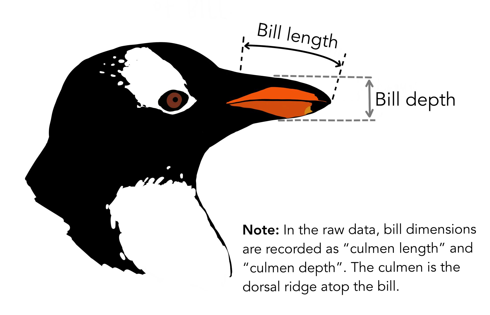

# Palmer Penguins

 .

## About This Project

    This notebook contains my analysis of the famous Palmer Penguins Data Set.
    It was a project set for my first Module in Data Analytics for ATU.

    The dataset was sourced from ("https://raw.githubusercontent.com/mwaskom/seaborn-data/master/penguins.csv").

The Palmer Penguins are 3 species of penguins: Adélie, Chinstrap, and Gentoo which were observed on islands near the Palmer Station, Antarctica. The data was collected over a period from 2007 to 2009 by Kristen Gorman.
 [Dr.Kristen Gorman](https://www.uaf.edu/cfos/people/faculty/detail/kristen-gorman.php)
 [Palmer Station, Antarctica LTER](https://pallter.marine.rutgers.edu/), works for the [Long Term Ecological Research Network](https://lternet.edu/).

 The data set includes the measurements of 344 penguins.There are eight variables. Species that I have mentioned, islands, bill length and depth, flipper length, body mass, sex and year.
The 3 categorical values are species:3, island :3 and sex :2. There are 4 continuous variables which are bill_length_mm: number showing length, bill_depth_mm: number showing depth. The flipper_length_mm: integer, showing length and body_mass_g: integer, showing mass in grams. Year is a discrete variable integer also.
I have concentrated on the bill length and depth.

Included in this work are scatterplots, histograms, a barchart and a box plot.
I created a scatterplot showing with color and shapes the visual pattern apparent between the Bill Length and Depth with also the flipper length.
The diamonds in the color magenta show the relationship with Bill Length and Bill Depth. They are tightly bunched in an almost horizontal line.
The hexagons in the color coral show the relationship with Bill Length and Flipper Length. There are some outliers visable here.
The stars in the color aqua show the relationship with Bill Depth and Flipper Length. They have two small groupings.

The stunning art work linked is by the talented Allison Horst.
 

## Use of This Project

    This project is useful because it utilizes the methods needed to give analysis on data, through code and images of graphs.

## Getting Started

    The user will need to have Jupyter Notebook Editor for Visual Studio Code (https://code.visualstudio.com/) in order to clone the repository.
     The code used is python, so Anaconda (https://www.anaconda.com/download) is my recommendation as it has so many built in functions such as Pandas, Matplotlib and Numpy and Seaborn.
     These Libraries were the first thing I imported as they are most useful for storing, visually showing and carrying out mathematical operations.

     "pandas is a fast, powerful, flexible and easy to use open source data analysis and manipulation tool, built on top of the Python programming language."
     (https://pandas.pydata.org/)

     "Matplotlib is a comprehensive library for creating static, animated, and interactive visualizations in Python. Matplotlib makes easy things easy and hard things possible."
    (https://matplotlib.org/)

    "Fast and versatile, the NumPy vectorization, indexing, and broadcasting concepts are the de-facto standards of array computing today."
    (https://numpy.org/)

    "Seaborn is a Python data visualization library based on matplotlib. It provides a high-level interface for drawing attractive and informative statistical graphics."
    (https://seaborn.pydata.org/)

I used [https://openincolab.com/](https://openincolab.com/). To generate the following link.
It opens the ` .ipnb`notebook in [Google Colab](https://colab.research.google.com/)

## Getting help

    If there is an issue or a query please don't hesitate to submit an issue on git hub.

## Author

    I study at [ATU](https://www.atu.ie/). I am a mature student returning to education. I have a Bachelors of Business Studies from the former Institute of Technology Sligo - now part of ATU. I find this an interesting subject and hope to continue learning online from the beautiful north west of Ireland. I will be looking for work in the near future and at this moment I will leave my contact as my University Email. G00438900@ATU.ie

***

## End
